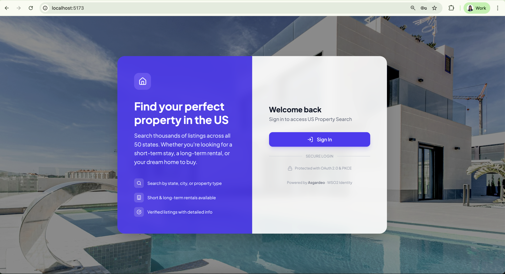
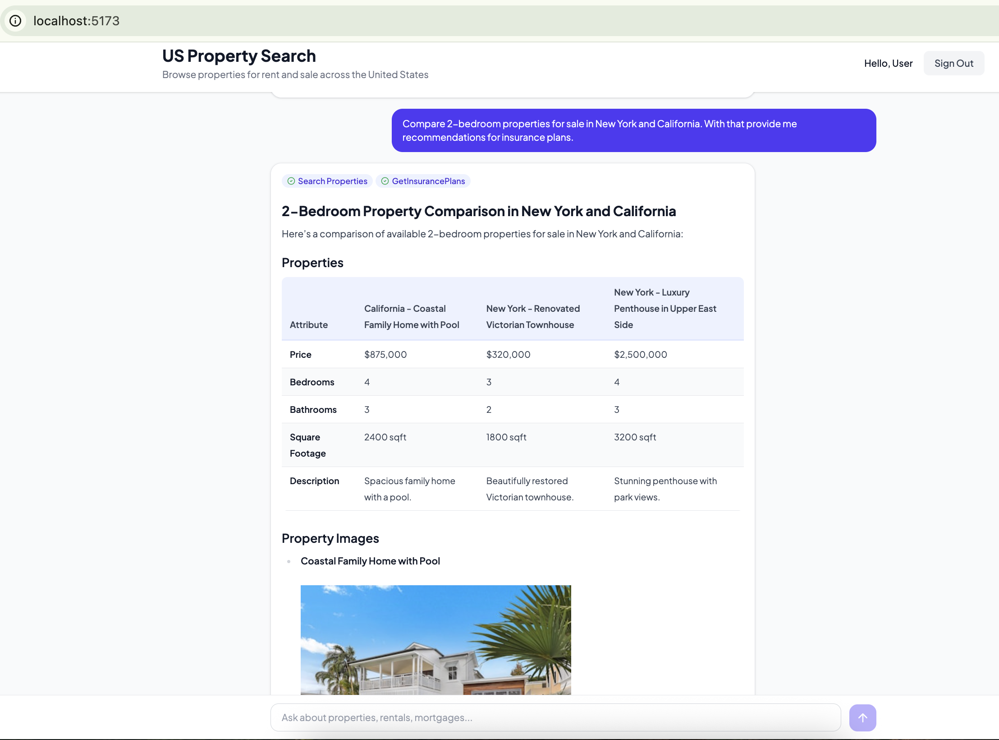
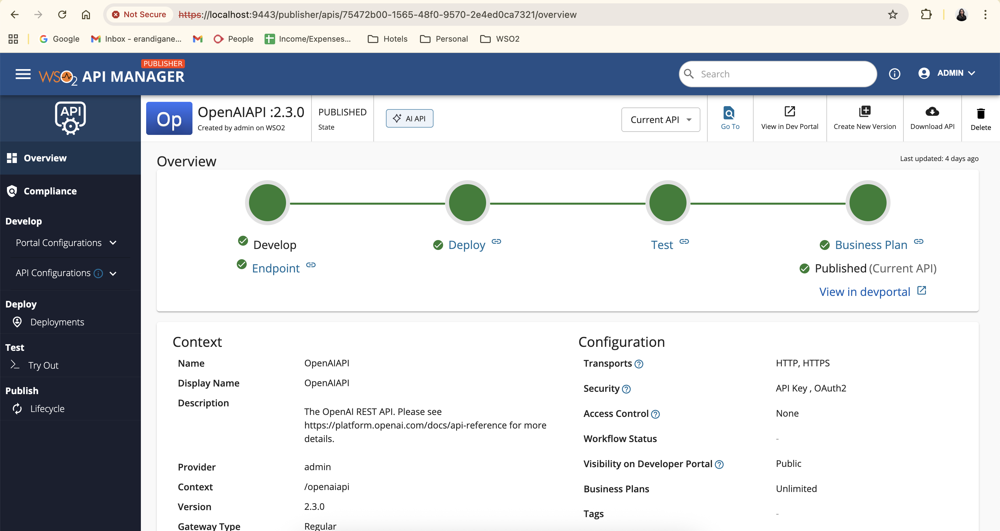
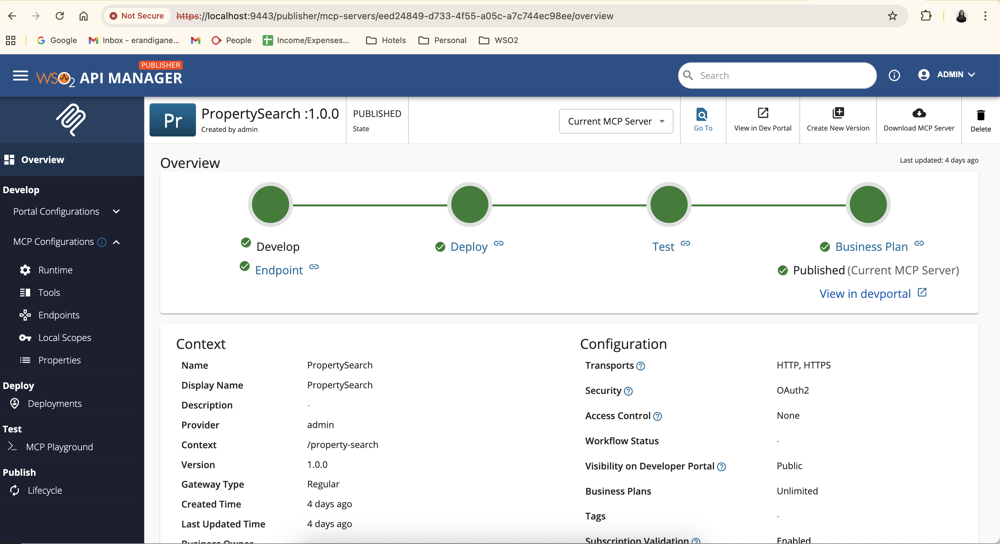
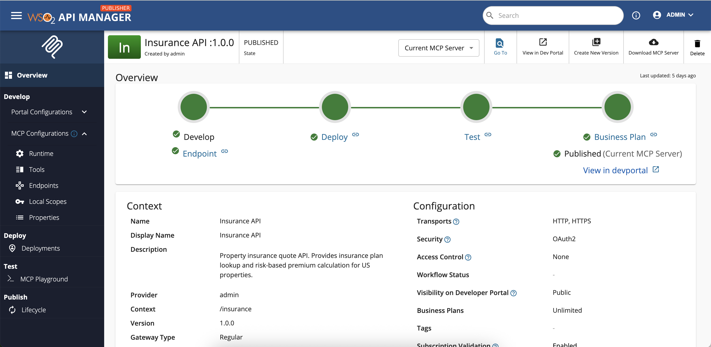

# Property Search & Insurance Agent

An AI-powered agent for US property search and insurance. Users chat with an LLM-powered assistant in natural language to search and compare property listings, calculate mortgages, explore neighborhoods, get personalized recommendations, and generate insurance quotes. The agent has access to 11 MCP tools (9 property + 2 insurance) exposed through WSO2 API Manager's MCP Gateway, with LLM calls routed through APIM's AI Gateway. The frontend is secured with Asgardeo OAuth2 + PKCE authentication, and scope-based access control (`list-rent`, `list-sale`) determines which property types each user can access.

## Architecture

```
┌───────────────────┐
│     Asgardeo      │
│  (OAuth2 + PKCE)  │
└─────────▲─────────┘
          │
     login/consent
          │
┌─────────┴───┐       SSE stream         ┌──────────────────┐
│   web/      │ ─────────────────────▶   │  agent-service/  │
│   React UI  │                          │  Express + LLM   │
│   :5173     │ ◀─────────────────────   │  :3002           │
└─────────────┘   text, tool calls,      └────────┬─────────┘
                  property data                   │
                                         APIM token (client credentials)
                                         OpenAI SDK + MCP client
                                                  │
                ┌─────────────────────────────────▼──────────────────────┐
                │              WSO2 API Manager 4.6  :8243               │
                │                                                        │
                │  ┌──────────────┐  ┌───────────────────────────────┐   │
                │  │  AI Gateway  │  │          MCP Gateway          │   │
                │  │  (OpenAI     │  │                               │   │
                │  │   proxy)     │  │  Property Search  Insurance   │   │
                │  │              │  │  MCP (proxy)      MCP (REST   │   │
                │  │              │  │                   API → MCP)  │   │
                │  └──────┬───────┘  └───────┬──────────────┬────────┘   │
                └─────────┼──────────────────┼──────────────┼────────────┘
                          │                  │              │
                 ┌────────▼────────┐  ┌──────▼────────────┐  ┌──────▼──────┐
                 │   OpenAI API    │  │ property-search-  │  │ insurance-  │
                 │                 │  │ mcp/ :3001        │  │ api/ :3003  │
                 └─────────────────┘  └───────────────────┘  └─────────────┘
```

### How It Technically Works

1. **User chats** in the React frontend, which streams messages to the agent service via SSE
2. **Agent service** authenticates to APIM using client credentials (OAuth2) and gets a token
3. **LLM calls** go through **APIM's AI Gateway** — the OpenAI SDK sends requests to `https://localhost:8243/openaiapi/2.3.0` using the APIM token, and APIM proxies to OpenAI with backend-configured API key
4. **Tool calls** go through **APIM's MCP Gateway**, which provides:
   - OAuth2 token validation and access control
   - Rate limiting and throttling
   - Analytics and monitoring
   - Protocol translation (REST → MCP for the insurance API)
5. **Two backend services** provide the actual tools:
   - **Property Search MCP** — a native MCP server proxied through APIM
   - **Insurance API** — a REST API converted to MCP tools by APIM from its OpenAPI spec
6. **Results stream back** to the frontend as SSE events (text, tool call indicators, property data)

### Components

| Component | Port | Stack | Role |
|-----------|------|-------|------|
| **web/** | 5173 | React 19 + Vite + Tailwind CSS 4 | Chat UI with property side panel, Asgardeo login |
| **agent-service/** | 3002 | Node.js + TypeScript + Express 5 | LLM orchestration, MCP client, SSE streaming |
| **WSO2 APIM** | 8243 | WSO2 API Manager 4.6 | AI Gateway (LLM proxy) + MCP Gateway — auth, rate limiting, analytics |
| **property-search-mcp/** | 3001 | Node.js + TypeScript | 9 property search tools (search, compare, mortgage, etc.) |
| **insurance-api/** | 3003 | Ballerina Swan Lake | Insurance quote API (plans lookup, premium calculation) |

### MCP Tools Available to the LLM

**Via Property Search MCP** (proxied through APIM):

| Tool | Description |
|------|-------------|
| `search_properties` | Search properties by US state(s) and type |
| `get_available_states` | List states with available properties |
| `get_property_summary` | Property count summary by type |
| `get_property_details` | Full details for a property by ID |
| `compare_properties` | Side-by-side comparison of 2-4 properties |
| `calculate_mortgage` | Monthly payment, total interest, total cost |
| `get_neighborhood_info` | Walk score, safety, schools, amenities |
| `get_user_profile` | User's search patterns and preferences |
| `get_personalized_recommendations` | AI-ranked property recommendations |

**Via Insurance API MCP** (REST converted to MCP by APIM):

| Tool | Description |
|------|-------------|
| `getInsurancePlans` | List available insurance coverage plans |
| `generateInsuranceQuote` | Calculate insurance premium for a property |

## User Experience

### 1. Landing Page

The application opens with a login screen featuring a property background.



### 2. Asgardeo Authentication

Clicking **Sign In** redirects the user to the Asgardeo identity provider (or WSO2 IAM as configured). Users can authenticate with their username and password, or use social login (e.g., Google). This ensures secure, standards-based OAuth2 + PKCE authentication before accessing the application.


### 3. AI-Powered Chat Interface

Once authenticated, users land in the chat interface where they can interact with the AI assistant using natural language. The assistant can:

- Search and compare properties across multiple states
- Display property comparisons in a structured table (price, bedrooms, bathrooms, square footage)
- Show property images inline
- Fetch insurance plans and generate quotes
- Calculate mortgage estimates

Tool calls (e.g., *Search Properties*, *GetInsurancePlans*) are shown as interactive pills in the conversation, giving users visibility into what the agent is doing behind the scenes.



## Setting Up APIs in WSO2 API Manager

WSO2 API Manager 4.6 serves as the central gateway for both LLM calls (AI Gateway) and tool calls (MCP Gateway). Below is a quick overview of how each API type is created in the APIM Publisher Portal.

### 1. AI API — OpenAI Proxy

To route LLM calls through APIM, create an **AI API** that proxies the OpenAI REST API. In the Publisher Portal, select **Create AI API** and point it at `https://api.openai.com/v1`. Configure endpoint security with the OpenAI API key so the key stays in APIM and is never exposed to client applications. APIM can then apply AI-specific policies such as guardrails, token-based rate limiting, and usage analytics on top.

Refer doc for more details - https://apim.docs.wso2.com/en/latest/api-design-manage/design/create-api/create-ai-api/create-an-ai-api/



### 2. MCP Server (Proxy) — Property Search

For backend services that already speak the MCP protocol, create an **MCP Server from existing MCP**. Point the endpoint at the backend MCP URL (e.g. `http://localhost:3001/mcp`) and APIM proxies requests through, adding OAuth2 validation, rate limiting, and analytics. The backend MCP server's tools are automatically discovered and exposed via the gateway.

Refer doc for more details - https://apim.docs.wso2.com/en/latest/ai-gateway/mcp-gateway/create-from-mcp-server/



### 3. MCP Server (from OpenAPI) — Insurance API

For REST APIs that need to be consumed as MCP tools by LLM agents, create an **MCP Server from OpenAPI definition**. Import the service's OpenAPI spec (e.g. `insurance-api/api_openapi.yaml`) and set the backend endpoint (e.g. `http://localhost:3003`). APIM automatically converts each REST operation into an MCP tool — agents call it via the MCP protocol, and APIM translates those calls into the corresponding REST requests to the backend.

Refer doc for more details - https://apim.docs.wso2.com/en/latest/ai-gateway/mcp-gateway/create-from-api/



### Insurance API — OpenAPI Definition

The Insurance REST API (backed by the Ballerina service in `insurance-api/`) exposes two endpoints that APIM converts into MCP tools. See the full OpenAPI spec at [`resources/insurance-api-openapi.yaml`](resources/insurance-api-openapi.yaml).

## Quick Start

### Prerequisites

- Node.js v18+
- [Ballerina Swan Lake](https://ballerina.io/downloads/) (Update 13+)
- [WSO2 API Manager 4.6](https://wso2.com/api-manager/)
- An OpenAI API key (configured as endpoint security in APIM, not in the app)
- An [Asgardeo](https://asgardeo.io/) organization with an OAuth2 SPA configured

### 1. Install dependencies

```bash
cd property-search-mcp && npm install
cd ../agent-service && npm install
cd ../web && npm install
cd ../insurance-api && bal build
```

### 2. Configure environment

Each Node.js project has a `.env.example` — copy and fill in:

```bash
cp property-search-mcp/.env.example property-search-mcp/.env
cp agent-service/.env.example agent-service/.env
cp "web/.env copy.example" web/.env
```

The agent service needs:
- `LLM_BASE_URL` — APIM AI Gateway endpoint (e.g. `https://localhost:8243/openaiapi/2.3.0`)
- `APIM_CONSUMER_KEY` / `APIM_CONSUMER_SECRET` — from APIM DevPortal application
- `MCP_SERVERS` — APIM gateway MCP endpoints

### 3. Set up WSO2 API Manager

1. Start APIM: `<APIM_HOME>/bin/api-manager.sh`
2. In the **Publisher Portal** (`https://localhost:9443/publisher`):
   - **AI Gateway**: Create REST API proxying `https://api.openai.com/v1`, configure endpoint security with the OpenAI API key (`Authorization: Bearer`). Follow the official documentation and add policies as Guardrails for the AI API - https://apim.docs.wso2.com/en/latest/ai-gateway/ai-guardrails/overview/
   - **MCP Gateway**: Create MCP Server from existing MCP → proxy `http://localhost:3001/mcp`
   - **MCP Gateway**: Create MCP Server from OpenAPI → import `insurance-api/api_openapi.yaml`, set endpoint to `http://localhost:3003`
   - Deploy and publish all three
3. In the **Developer Portal** (`https://localhost:9443/devportal`):
   - Create an application, subscribe to all three APIs
   - Generate production keys (client credentials grant)
   - Add the consumer key/secret to `agent-service/.env`

### 4. Start all services

```bash
# Terminal 1: MCP Server
cd property-search-mcp && npm run build && npm start

# Terminal 2: Insurance API
cd insurance-api && bal run

# Terminal 3: Agent Service
cd agent-service && npm run build && npm start

# Terminal 4: Frontend
cd web && npm run dev
```

Open `http://localhost:5173`, sign in via Asgardeo, and start chatting.

## Project Structure

```
property-search/
├── web/                    # React frontend
├── agent-service/          # LLM agent + MCP client
│   └── src/mcp/
│       ├── mcpManager.ts   # Multi-server MCP client manager
│       └── apimToken.ts    # APIM client credentials token provider
├── property-search-mcp/             # Property search MCP server (9 tools)
├── insurance-api/          # Ballerina insurance quote REST API
│   └── api_openapi.yaml    # OpenAPI spec (used by APIM for MCP conversion)
├── CLAUDE.md               # Project conventions
└── README.md
```

See each subdirectory's README for detailed setup and configuration.
