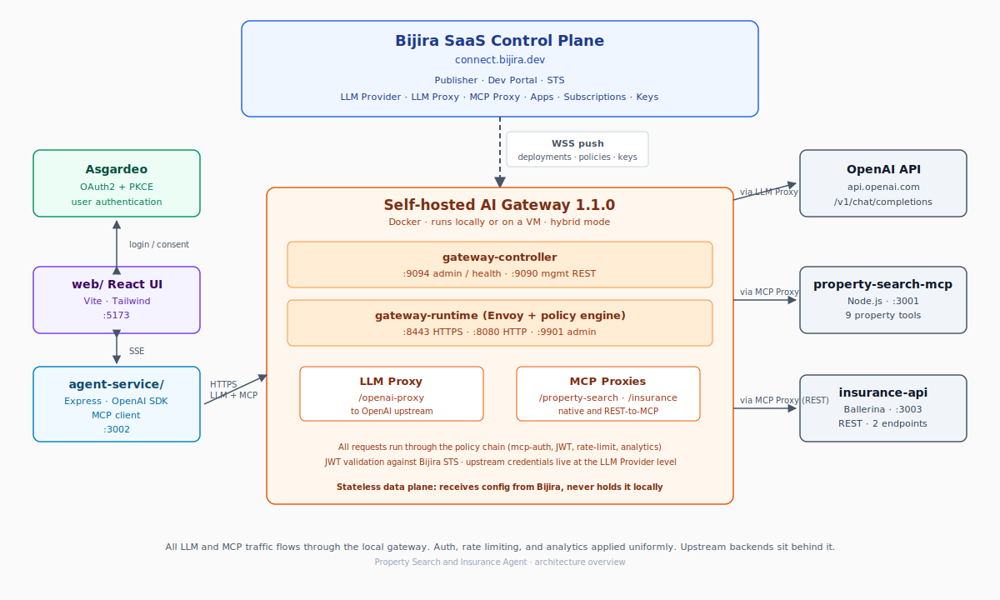
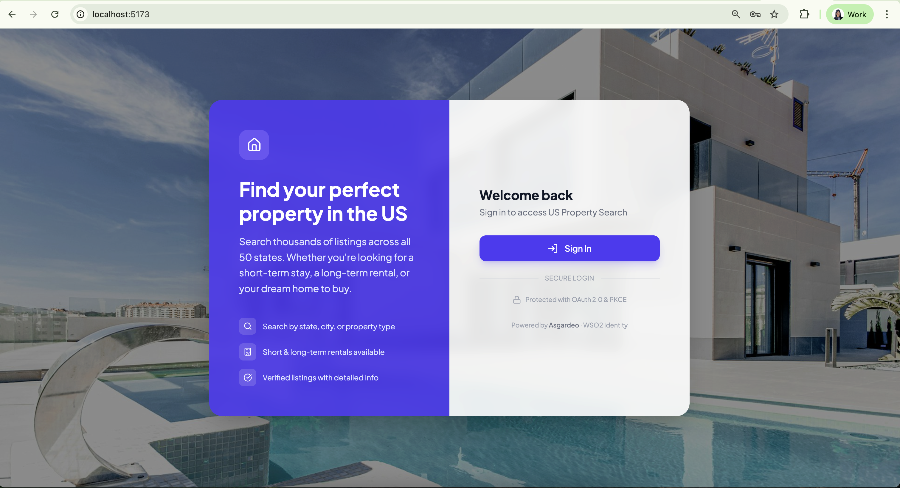
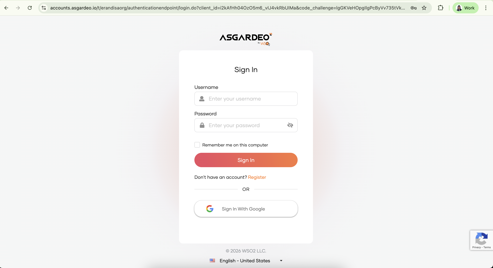
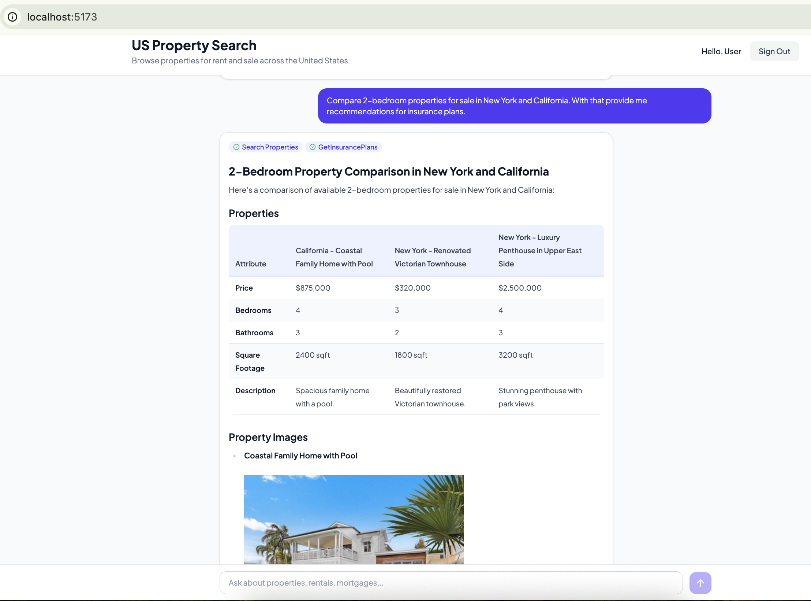

# Property Search & Insurance Agent

An AI-powered agent for US property search and insurance. Users chat with an LLM-powered assistant in natural language to search and compare property listings, calculate mortgages, explore neighborhoods, get personalized recommendations, and generate insurance quotes. The agent has access to 11 MCP tools (9 property + 2 insurance) exposed through the WSO2 self-hosted **AI Gateway**, with LLM calls and MCP traffic both routed through that same gateway. Lifecycle management (LLM Provider, LLM Proxy, MCP Proxy, applications, subscriptions) lives in the **Bijira SaaS control plane**, which pushes deployments down to the local hybrid gateway. The frontend is secured with Asgardeo OAuth2 + PKCE authentication, and scope-based access control (`list-rent`, `list-sale`) determines which property types each user can access.

## Architecture



<details>
<summary>ASCII fallback</summary>

```
                 ┌────────────────────────────────────┐
                 │       Bijira SaaS Control Plane    │
                 │       (connect.bijira.dev)         │
                 │                                    │
                 │  Publisher · Dev Portal · STS      │
                 │  LLM Provider, LLM Proxy, MCP      │
                 │  Proxy, Apps, Subscriptions, Keys  │
                 └────────────────┬───────────────────┘
                                  │  WSS push (deployments,
                                  │  policies, app keys)
                                  │
┌───────────────────┐             │
│     Asgardeo      │             ▼
│  (OAuth2 + PKCE)  │   ┌──────────────────────────────────┐
└─────────▲─────────┘   │  Self-hosted AI Gateway 1.1.0    │
          │             │   (Docker, runs locally / VM)    │
     login/consent      │                                  │
          │             │  gateway-controller :9094 admin  │
┌─────────┴───┐  SSE    │  gateway-runtime  :8443 HTTPS    │
│   web/      │ ──────▶ │                  :8080 HTTP      │
│   React UI  │         │                                  │
│   :5173     │ ◀────── │  ┌──────────┐  ┌──────────────┐  │
└─────────────┘  text,  │  │   LLM    │  │     MCP      │  │
                 tool   │  │  Proxy   │  │   Proxies    │  │
                 calls  │  │ (OpenAI) │  │              │  │
                        │  └────┬─────┘  └──┬────────┬──┘  │
                        └───────┼───────────┼────────┼─────┘
                                │           │        │
                       ┌────────▼──────┐    │        │
                       │  OpenAI API   │    │        │
                       └───────────────┘    │        │
                                            │        │
                              ┌─────────────▼─┐  ┌───▼───────────┐
                              │ property-     │  │ insurance-    │
                              │ search-mcp/   │  │ api/ :3003    │
                              │ :3001         │  │ (REST → MCP   │
                              └───────────────┘  │  by gateway)  │
                                                 └───────────────┘
```

</details>

### How It Technically Works

1. **User chats** in the React frontend, which streams messages to the agent service via SSE.
2. **Agent service** authenticates to Bijira's STS using client credentials (OAuth2) and gets an access token.
3. **LLM calls** go through the gateway's **LLM Proxy**. The OpenAI SDK sends requests to `https://localhost:8443/<llm-proxy-context>` using the Bijira token; the gateway proxies to OpenAI with the upstream API key configured at the LLM Provider level (the key never leaves the gateway).
4. **Tool calls** go through the gateway's **MCP Proxies**, which provide:
   - OAuth2 token validation (via the `mcp-auth` policy and Bijira's STS as the JWT issuer)
   - Rate limiting and throttling
   - Analytics and observability
   - Protocol translation (REST to MCP for the insurance API)
5. **Two backend services** provide the actual tools:
   - **Property Search MCP**, a native MCP server proxied through the gateway as an MCP Proxy.
   - **Insurance API**, a REST API converted to MCP tools by the gateway from its OpenAPI spec.
6. **Results stream back** to the frontend as SSE events (text, tool call indicators, property data).

The gateway is a single Envoy-based runtime that handles both LLM and MCP traffic. Bijira pushes deployment changes (new providers, proxies, policy updates, app subscriptions) down over a WebSocket so the local gateway stays in sync without restarts.

### Components

| Component | Port | Stack | Role |
|-----------|------|-------|------|
| **web/** | 5173 | React 19 + Vite + Tailwind CSS 4 | Chat UI with property side panel, Asgardeo login |
| **agent-service/** | 3002 | Node.js + TypeScript + Express 5 | LLM orchestration, MCP client, SSE streaming |
| **AI Gateway (self-hosted)** | 8443 (HTTPS), 8080 (HTTP), 9094 (admin) | WSO2 API Platform AI Gateway 1.1.0 (Envoy + controller) | LLM Proxy and MCP Proxies, auth, rate limiting, analytics. Hybrid: local runtime, SaaS control plane. |
| **Bijira (SaaS)** | n/a | Bijira (`connect.bijira.dev`) | Control plane: Publisher, Dev Portal, STS, deployment manager |
| **property-search-mcp/** | 3001 | Node.js + TypeScript | 9 property search tools (search, compare, mortgage, etc.) |
| **insurance-api/** | 3003 | Ballerina Swan Lake | Insurance quote API (plans lookup, premium calculation) |

### MCP Tools Available to the LLM

**Via Property Search MCP** (proxied through the AI Gateway):

| Tool | Description |
|------|-------------|
| `search_properties` | Search properties by US state(s) and type |
| `get_available_states` | List states with available properties |
| `get_property_summary` | Property count summary by type |
| `get_property_details` | Full details for a property by ID |
| `compare_properties` | Side-by-side comparison of 2-4 properties |
| `calculate_mortgage` | Monthly payment, total interest, total cost |
| `get_neighborhood_info` | Walk score, safety, schools, amenities |
| `get_user_profile` | User's search patterns and preferences |
| `get_personalized_recommendations` | AI-ranked property recommendations |

**Via Insurance API MCP** (REST converted to MCP by the gateway):

| Tool | Description |
|------|-------------|
| `getInsurancePlans` | List available insurance coverage plans |
| `generateInsuranceQuote` | Calculate insurance premium for a property |

## User Experience

### 1. Landing Page

The application opens with a login screen featuring a property background.



### 2. Asgardeo Authentication

Clicking **Sign In** redirects the user to the Asgardeo identity provider. Users can authenticate with their username and password, or use social login (e.g., Google). This ensures secure, standards-based OAuth2 + PKCE authentication before accessing the application.



### 3. AI-Powered Chat Interface

Once authenticated, users land in the chat interface where they can interact with the AI assistant using natural language. The assistant can:

- Search and compare properties across multiple states
- Display property comparisons in a structured table (price, bedrooms, bathrooms, square footage)
- Show property images inline
- Fetch insurance plans and generate quotes
- Calculate mortgage estimates

Tool calls (e.g., *Search Properties*, *getInsurancePlans*) are shown as interactive pills in the conversation, giving users visibility into what the agent is doing behind the scenes.



## Setting Up the Self-Hosted AI Gateway with Bijira

This project runs the WSO2 API Platform **AI Gateway 1.1.0** locally (or on a VM) in **hybrid mode**, registered against your **Bijira** project as the control plane. All LLM and MCP traffic flows through that gateway; everything else (authoring, lifecycle, app subscriptions, keys) is managed in Bijira's UI.

### Prerequisites

- A Bijira project (sign up at [bijira.dev](https://bijira.dev)). Inside it, register a new **hybrid gateway** and copy the **Gateway Key** (registration token).
- Docker and Docker Compose (Rancher Desktop or Docker Desktop on macOS/Windows; Docker Engine + Compose on Linux).
- An OpenAI API key (configured at the LLM Provider in Bijira, not in the application).
- The local ports `8080`, `8443`, `9090`, `9094` free.

### 1. Download and start the AI Gateway

```bash
curl -LO https://github.com/wso2/api-platform/releases/download/ai-gateway/v1.1.0/wso2apip-ai-gateway-1.1.0.zip
unzip wso2apip-ai-gateway-1.1.0.zip
cd wso2apip-ai-gateway-1.1.0
```

Create a `.env` file alongside `docker-compose.yaml`:

```bash
cat > .env <<'EOF'
GATEWAY_CONTROLPLANE_HOST=connect.bijira.dev
GATEWAY_REGISTRATION_TOKEN=<paste-bijira-gateway-key>
EOF
```

Start the stack and verify it registers:

```bash
docker compose up -d
curl -sS http://localhost:9094/health
docker compose logs gateway-controller | grep -iE 'control plane|connection state|gateway_id'
```

You want to see `Connection state changed from=connecting to=connected` and a `gateway_id=...`. The gateway should now show as **Connected** in the Bijira UI under your project's Gateways view.

<!-- TODO: capture screenshot of Bijira Gateways page with the hybrid gateway shown as Connected, save as images/bijira-gateway-connected.png, then replace this placeholder with:  -->
> _Screenshot placeholder: Bijira UI → Gateways, hybrid gateway showing as Connected._

### 2. Create the LLM Provider in Bijira

In the Bijira Publisher, create an **LLM Provider** that points at OpenAI:

- **Template:** OpenAI
- **Upstream URL:** `https://api.openai.com/v1`
- **Auth:** API key, header `Authorization`, value `Bearer <YOUR_OPENAI_API_KEY>`
- **Access control:** `deny_all` with exceptions for `POST /chat/completions`, `GET /models`, `GET /models/{modelId}`

This provider is shared infrastructure: keys live here, never in the agent.

<!-- TODO: capture screenshot of the LLM Provider config page in Bijira, save as images/bijira-llm-provider.png, then replace this placeholder with:  -->
> _Screenshot placeholder: Bijira Publisher → LLM Provider configured for OpenAI._

### 3. Create the LLM Proxy

Create an **LLM Proxy** on top of the provider so the agent can consume it. Pick a context like `/openai-proxy` or `/assistant`. Deploy it to your hybrid gateway. The proxy URL will be `https://localhost:8443/<context>` (or whatever vhost Bijira shows you for the hybrid gateway).

<!-- TODO: capture screenshot of the LLM Proxy config + deploy view in Bijira, save as images/bijira-llm-proxy.png, then replace this placeholder with:  -->
> _Screenshot placeholder: Bijira Publisher → LLM Proxy deployed to the hybrid gateway._

### 4. Create the MCP Proxies

#### 4a. Property Search MCP (proxy mode)

Create an **MCP Proxy from existing MCP server**. Point the upstream at `http://host.docker.internal:3001/mcp` so the gateway container can reach the MCP server running on your host. Pick a context like `/property-search`. Deploy.

<!-- TODO: capture screenshot of the Property Search MCP Proxy in Bijira, save as images/bijira-mcp-proxy-property-search.png, then replace this placeholder with:  -->
> _Screenshot placeholder: Bijira Publisher → MCP Proxy for Property Search MCP._

#### 4b. Insurance API (REST to MCP)

Create an **MCP Proxy from OpenAPI definition**. Import [`resources/insurance-api-openapi.yaml`](resources/insurance-api-openapi.yaml) and set the backend to `http://host.docker.internal:3003`. The gateway converts each REST operation into an MCP tool. Deploy.

<!-- TODO: capture screenshot of the Insurance MCP Proxy (REST→MCP) in Bijira, save as images/bijira-mcp-proxy-insurance.png, then replace this placeholder with:  -->
> _Screenshot placeholder: Bijira Publisher → MCP Proxy for the Insurance API (REST to MCP)._

### 5. Subscribe an Application and generate keys

In the Bijira **Developer Portal**:

1. Create an Application (e.g. `property-search-agent`).
2. Subscribe it to the LLM Proxy and both MCP Proxies.
3. Generate **Production keys** (client credentials). Copy the consumer key and secret into `agent-service/.env`.

<!-- TODO: capture screenshot of the application's subscriptions + credentials view in Bijira Dev Portal, save as images/bijira-app-subscriptions.png, then replace this placeholder with:  -->
> _Screenshot placeholder: Bijira Dev Portal → Application with subscriptions to LLM Proxy + 2 MCP Proxies, Production keys generated._

### 6. Test from the Dev Portal MCP Playground

Each MCP Proxy in the Bijira Dev Portal has an **MCP Playground** tab. Use it to:

1. Generate or paste a token.
2. **List Tools** to confirm the gateway has discovered them.
3. Execute a tool (e.g. `getInsurancePlans`) end to end before wiring the agent.

This is the fastest way to verify each proxy individually.

<!-- TODO: capture screenshot of the MCP Playground after a successful tool call, save as images/bijira-mcp-playground.png, then replace this placeholder with:  -->
> _Screenshot placeholder: Bijira Dev Portal → MCP Playground listing tools and showing a successful tool execution._

### Notes on securing MCP with tokens

Bijira's STS issues the JWTs your agent presents. To enforce auth on each MCP Proxy, attach the `mcp-auth` policy in the proxy definition. The minimal user-level policy:

```yaml
policies:
  - name: mcp-auth
    version: v1
    params:
      issuers:
        - BijiraSTS
```

The system-level `keyManagers` (issuer URL and JWKS URI for `BijiraSTS`) live in the gateway's `configs/config.toml` under `[policy_configurations.jwtauth_v1]`. See the `mcp-auth` policy reference at [github.com/wso2/gateway-controllers/tree/main/docs/mcp-auth](https://github.com/wso2/gateway-controllers/tree/main/docs/mcp-auth).

## Quick Start

### Prerequisites

- Node.js v18+
- [Ballerina Swan Lake](https://ballerina.io/downloads/) (Update 13+)
- A running self-hosted AI Gateway connected to Bijira (see [Setting Up the Self-Hosted AI Gateway with Bijira](#setting-up-the-self-hosted-ai-gateway-with-bijira) above)
- An OpenAI API key (configured at the Bijira LLM Provider, not in the app)
- An [Asgardeo](https://asgardeo.io/) organization with an OAuth2 SPA configured

### 1. Install dependencies

```bash
cd property-search-mcp && npm install
cd ../agent-service && npm install
cd ../web && npm install
cd ../insurance-api && bal build
```

### 2. Configure environment

Each Node.js project has a `.env.example`. Copy and fill in:

```bash
cp property-search-mcp/.env.example property-search-mcp/.env
cp agent-service/.env.example agent-service/.env
cp "web/.env copy.example" web/.env
```

The agent service needs:
- `LLM_BASE_URL`, the AI Gateway's LLM Proxy URL (e.g. `https://localhost:8443/openai-proxy`)
- `APIM_CONSUMER_KEY` / `APIM_CONSUMER_SECRET`, generated in the Bijira Dev Portal application
- `APIM_TOKEN_URL`, Bijira STS token endpoint (e.g. `https://sts.bijira.dev/oauth2/token`)
- `MCP_SERVERS`, JSON array pointing at the gateway's MCP Proxy URLs

Example `.env` snippet:

```bash
LLM_BASE_URL=https://localhost:8443/openai-proxy
APIM_CONSUMER_KEY=<from Bijira Dev Portal app>
APIM_CONSUMER_SECRET=<from Bijira Dev Portal app>
APIM_TOKEN_URL=https://sts.bijira.dev/oauth2/token
MCP_SERVERS=[{"name":"property-search","url":"https://localhost:8443/property-search/mcp"},{"name":"insurance","url":"https://localhost:8443/insurance/mcp"}]
```

> The `APIM_*` variable names are kept for backward compatibility with the existing code. The values now point at Bijira, not WSO2 APIM 4.6.

### 3. Start the gateway

If it isn't running already:

```bash
cd <wherever>/wso2apip-ai-gateway-1.1.0
docker compose up -d
```

### 4. Start all services

```bash
# Terminal 1: Property Search MCP
cd property-search-mcp && npm run build && npm start

# Terminal 2: Insurance API
cd insurance-api && bal run

# Terminal 3: Agent Service
cd agent-service && npm run build && npm start

# Terminal 4: Frontend
cd web && npm run dev
```

Open `http://localhost:5173`, sign in via Asgardeo, and start chatting.

> **Note:** The agent service fetches a Bijira OAuth2 token at startup and uses it for all MCP connections. If you see credential errors when calling tools (e.g. "credential error" searching properties), restart the agent service to refresh the token: `cd agent-service && npm run build && npm start`.

## Project Structure

```
property-search/
├── web/                    # React frontend
├── agent-service/          # LLM agent + MCP client
│   └── src/mcp/
│       ├── mcpManager.ts   # Multi-server MCP client manager
│       └── apimToken.ts    # OAuth2 client-credentials token provider (now points at Bijira STS)
├── property-search-mcp/    # Property search MCP server (9 tools)
├── insurance-api/          # Ballerina insurance quote REST API
│   └── api_openapi.yaml    # OpenAPI spec (used by the gateway for REST-to-MCP conversion)
├── images/                 # Screenshots referenced from this README
├── resources/              # OpenAPI spec and historical assets
├── CLAUDE.md               # Project conventions
└── README.md
```

See each subdirectory's README for detailed setup and configuration.

## Migration note

This project previously used **WSO2 API Manager 4.6** as the central gateway (AI Gateway + MCP Gateway). It has been migrated to the WSO2 API Platform **AI Gateway 1.1.0** running self-hosted in **hybrid mode**, with **Bijira** as the SaaS control plane. The agent's runtime contract (OAuth2 client credentials, OpenAI-compatible LLM endpoint, MCP-over-HTTP tool endpoints) is unchanged; only the deployment topology and the publisher/dev-portal UI for managing it have changed.
